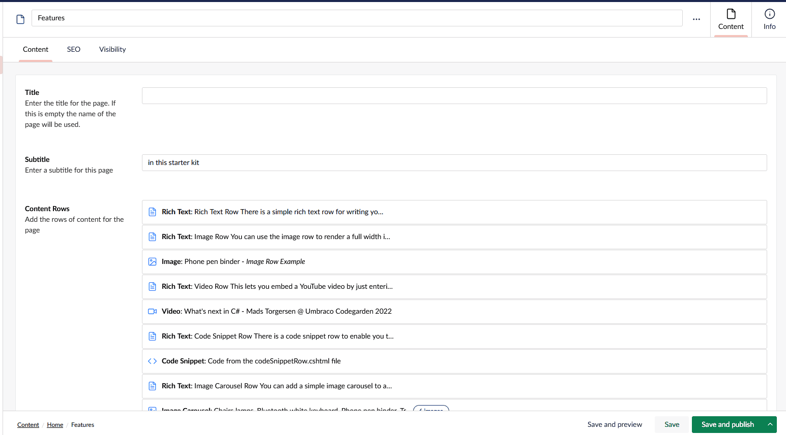
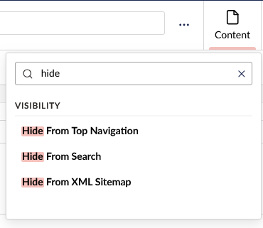
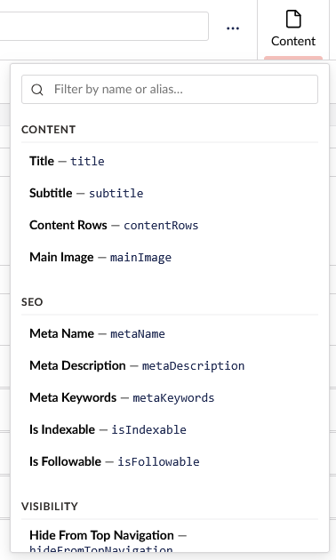
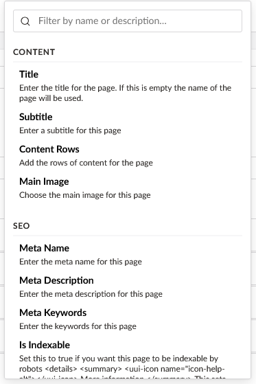
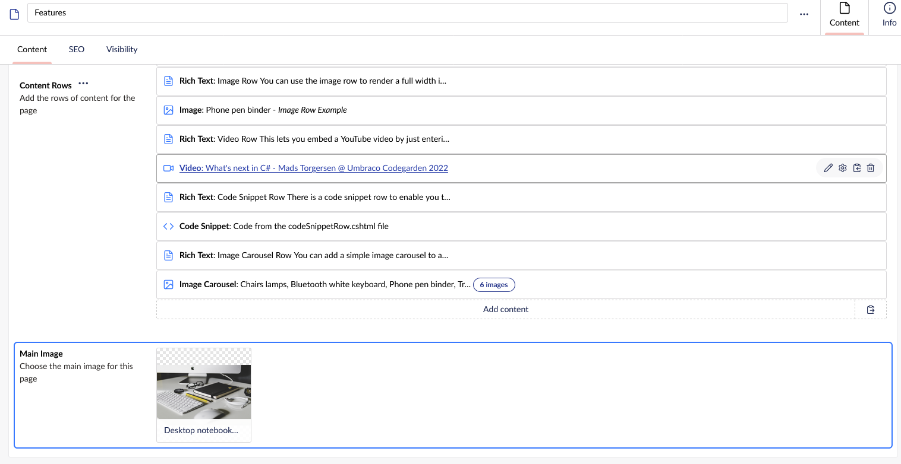

# Umbraco.Community.PropertyNavigator (Umbraco 17)

An **Umbraco 17** backoffice package for quickly finding and jumping to any
property on a content node.

**Click the Content view** (top right) while you're already on it and a
dropdown lists every field on the node — just like v13's Content app. Type to
filter, click to jump straight to the field.

**See it in action**



## Install

```
dotnet add package Umbraco.Community.PropertyNavigator
```

Restart the site and open any content node.

## Configuration

**Filter as you type**



All settings are optional. Anything you leave out uses its default below, and
with no `PropertyNavigator` section at all the package is simply on with the
defaults. To change something, add to `appsettings.json`:

```json
"PropertyNavigator": {
  "Enabled": true,
  "EnableSearch": true,
  "ShowDescriptions": false,
  "ShowAliases": false,
  "HighlightField": true
}
```

| Setting | Default | What it does |
|---|---|---|
| `Enabled` | `true` | Master switch. `false` turns the package off: the Content view behaves exactly as stock Umbraco. |
| `EnableSearch` | `true` | Show the filter box above the list. |
| `ShowDescriptions` | `false` | Show each field's description, and match it when filtering. |
| `ShowAliases` | `false` | Show each field's property alias (for all users), and match it when filtering. |
| `HighlightField` | `true` | Briefly draw a ring around the field after jumping to it. `false` just scrolls to it. |

**With `ShowAliases` enabled**



**With `ShowDescriptions` enabled**



The filter always matches the field name, and only matches aliases /
descriptions when they're shown. Changes apply on the next backoffice page load
— no restart needed.

**Jump to a field, with a highlight ring**



## Repository layout

```
src/
├── Directory.Packages.props                       # central package versions (Umbraco 17.0.0 floor)
├── Umbraco.Community.PropertyNavigator.slnx
├── Umbraco.Community.PropertyNavigator/           # the package (Razor Class Library → NuGet)
│   ├── Configuration/PropertyNavigatorOptions.cs  # the appsettings options
│   ├── Controllers/PropertyNavigatorConfigController.cs  # exposes them to the backoffice
│   ├── Composers/PropertyNavigatorComposer.cs     # options binding + Swagger doc
│   └── wwwroot/App_Plugins/PropertyNavigator/     # the backoffice extension (no-build JS)
└── Umbraco.Community.PropertyNavigator.TestSite/  # Umbraco 17.7 + Clean 7.0.8 starter kit, references the package
docs/
├── README_nuget.md                                # the README shown on NuGet
├── icon.png / icon.svg                            # package icon (128px PNG packed; SVG is the source)
├── screenshots/                                   # README / NuGet / Marketplace screenshots + demo GIF
└── HOW-IT-WORKS.md                                # implementation notes + v17 gotchas
umbraco-marketplace.json                           # Umbraco Marketplace listing metadata
CHANGELOG.md                                       # release notes (linked from the NuGet package)
.github/workflows/build.yml                        # PRs / main → build + pack check
.github/workflows/release.yml                      # tag → pack → push to NuGet
```

Structure follows Lotte Pitcher's
[Opinionated Package Starter](https://github.com/LottePitcher/opinionated-package-starter),
except the client side stays as plain no-build JS (no Vite/TypeScript).

## Developing

Open `src/Umbraco.Community.PropertyNavigator.slnx` and run the **TestSite**
(`https://localhost:44396/umbraco`). On first run it installs itself unattended
(SQLite) with the Clean starter kit, and a local admin:

- **Email:** `admin@example.com`
- **Password:** `1234567890`

These are throwaway credentials for the local test database only (set in
`TestSite/appsettings.Development.json`, the same as `dotnet new umbraco
--friendly-name "Administrator" --email "admin@example.com" --password
"1234567890"` generates) — never reuse them anywhere real.

After the first run, per the Clean starter kit's setup steps: log in, **save and
publish the Home page**, and **save one dictionary item** in the Translation
section — the front end renders after that. (The backoffice, and so the
navigator, works without it.)

> **Why the full `Clean` package, not `Clean.Core`?** Clean's docs advise
> switching to `Clean.Core` once a site is set up, so the build stops overwriting
> your views/assets. That's right for a real site, but not for this test site:
> Clean's content import lives in the `Clean` package, and the test database
> isn't committed — so with `Clean.Core` a fresh clone would have no document
> types or content to navigate. We never customise Clean's views here, so the
> re-copy on build is harmless; its generated files are gitignored.

The package's JS is served straight from its `wwwroot` via static web assets, so
JS edits show up on a browser refresh (hard-refresh if cached); C# changes and
`umbraco-package.json` changes need a restart.

The package builds against the **minimum** supported Umbraco (17.0.0) via
central package versions (`src/Directory.Packages.props`). The test site is
straight from `dotnet new umbraco` (17.7.0) with the template's inline package
versions, so its own `Directory.Packages.props` switches central versioning off
for it.

## Compatibility

Umbraco 17.
