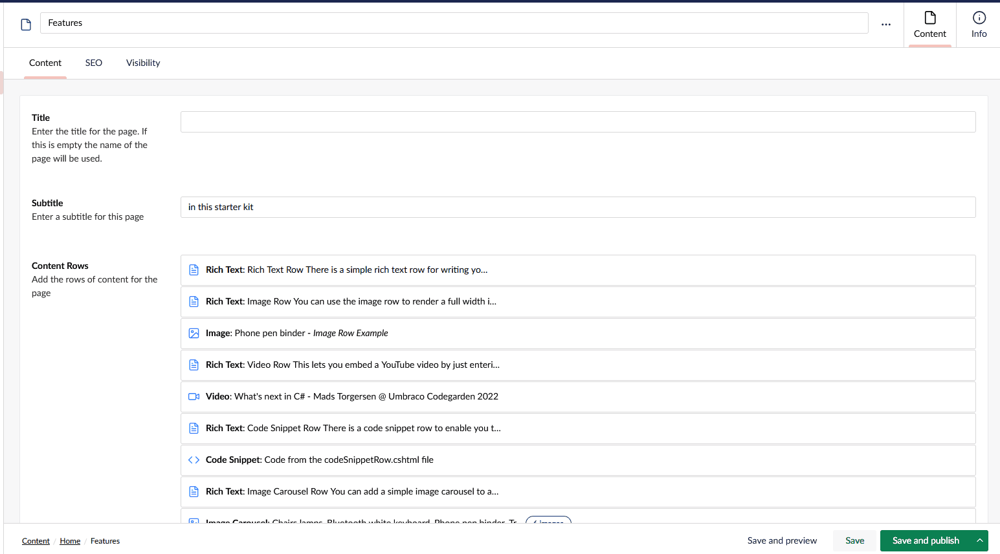
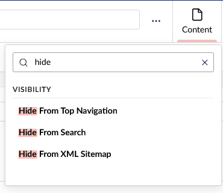
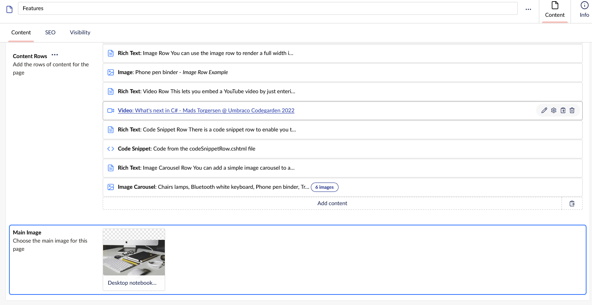
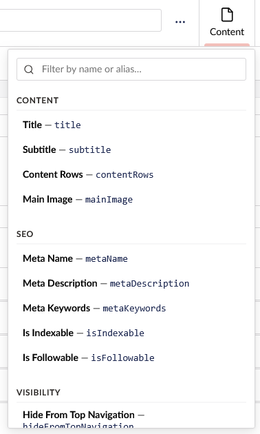
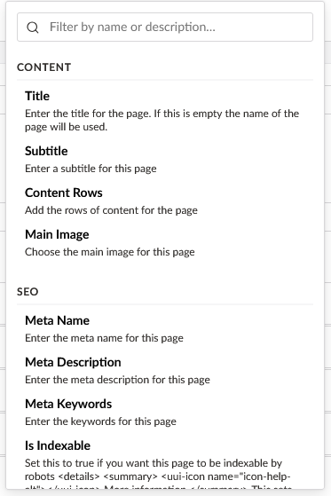

#  Property Navigator for Umbraco

[](https://www.nuget.org/packages/Umbraco.Community.PropertyNavigator)
[](https://marketplace.umbraco.com/package/umbraco.community.propertynavigator)
[](https://umbraco.com)
[](https://github.com/manutdkid77/Umbraco.Community.PropertyNavigator/actions/workflows/build.yml)
[](LICENSE)

Find and jump to any property on a content node, straight from the Content view.



## Features

Remember v13's Content app for jumping between fields? This brings it back to
the Umbraco 17 backoffice.

- **One click** — click the **Content** view (top right) while you're already on
  it and a dropdown lists every field on the node.
- **Filter as you type** — narrow a long document type down to the field you want.
- **Jump straight there** — the editor scrolls to the field and briefly rings it
  so your eye lands in the right place.
- **Keyboard friendly** — open, filter, jump and close (Escape) without touching
  the mouse.
- **Optional aliases & descriptions** — show (and search) property aliases or
  descriptions when that helps your editors.
- **Zero setup** — install, restart, done. No build step, no config required.

## Installation

```bash
dotnet add package Umbraco.Community.PropertyNavigator
```

Restart the site and open any content node.

## Configuration

All settings are optional. With no `Umbraco.Community.PropertyNavigator` section
at all, the package is simply on with the defaults. To change something, add to
`appsettings.json`:

```json
"Umbraco.Community.PropertyNavigator": {
  "Enabled": true,
  "EnableSearch": true,
  "ShowDescriptions": false,
  "ShowAliases": false,
  "HighlightField": true
}
```

| Setting | Default | What it does |
|---|---|---|
| `Enabled` | `true` | Master switch. `false` turns the package off: the Content view behaves exactly as stock Umbraco. |
| `EnableSearch` | `true` | Show the filter box above the list. |
| `ShowDescriptions` | `false` | Show each field's description, and match it when filtering. |
| `ShowAliases` | `false` | Show each field's property alias (for all users), and match it when filtering. |
| `HighlightField` | `true` | Briefly draw a ring around the field after jumping to it. `false` just scrolls to it. |

The filter always matches the field name, and only matches aliases /
descriptions when they're shown. Changes apply on the next backoffice page load
— no restart needed.

## Screenshots

**Filter as you type**



**Jump to a field, with a highlight ring**



**With `ShowAliases` enabled**



**With `ShowDescriptions` enabled**



## Compatibility

| Umbraco | Package |
|---|---|
| 17.x | Supported (built against 17.0.0) |

## Contributing

Issues and pull requests are welcome. See [CONTRIBUTING.md](CONTRIBUTING.md) for how to run the
package locally and submit changes.

## Further reading

- [Introducing Umbraco.Community.PropertyNavigator](https://www.nathanielnunes.com/blog/introducing-umbraco-community-propertynavigator): the story behind the package.

## License

[MIT](LICENSE) © Nathaniel Nunes
